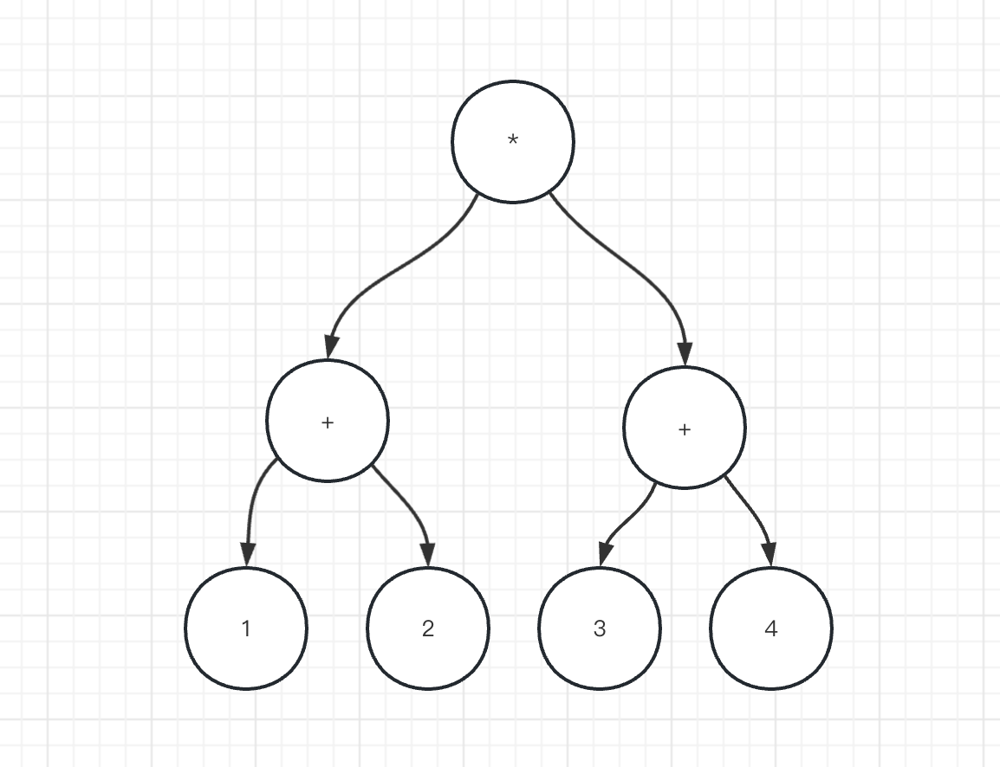

# 逆波兰表达式求值（leetcode150）

## 思路
本题是栈的经典应用  
1、对于之前不知道逆波兰表达式是什么的我来说，想到用栈来解决是非常困难的，那么什么是逆波兰表达式呢？  
2、对于(1+2) * (3+4)符合人类思维的是中缀表达式，也就是一颗二叉树的中序遍历   

3、可以使用栈，遍历表达式，当遇见数字进行压栈，遇见运算符号取出栈顶两个元素进行运算，并将结果压栈  


```java
class Solution {
    public int evalRPN(String[] tokens) {
        Stack<Integer> stack = new Stack<>();
        for (int i = 0; i < tokens.length; i++) {
            String token = tokens[i];
            if (!"+".equals(token) && !"-".equals(token) && !"*".equals(token) && !"/".equals(token)) {
                stack.push(Integer.valueOf(token));
            } else {
                int num1 = stack.pop();
                int num2 = stack.pop();
                int res = 0;
                if ("+".equals(token)) {
                    res = num2 + num1;
                }
                if ("-".equals(token)) {
                    res = num2 - num1;
                }
                if ("*".equals(token)) {
                    res = num2 * num1;
                }
                if ("/".equals(token)) {
                    res = num2 / num1;
                }
                stack.push(res);
            }
        }
        return stack.pop();
    }
}
```
